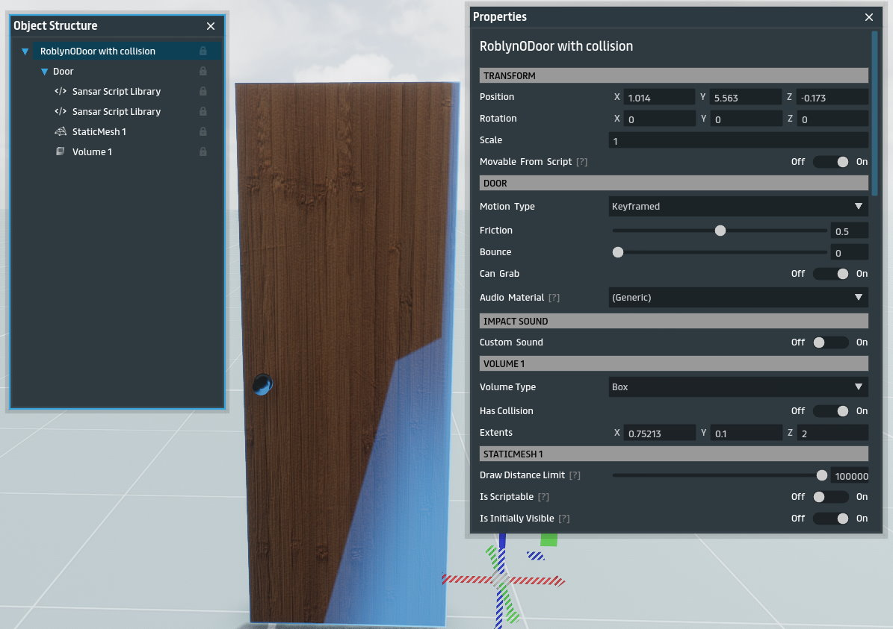
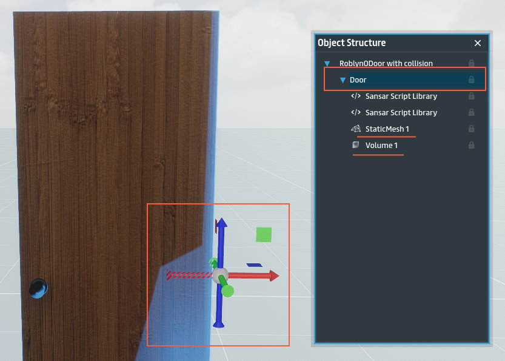
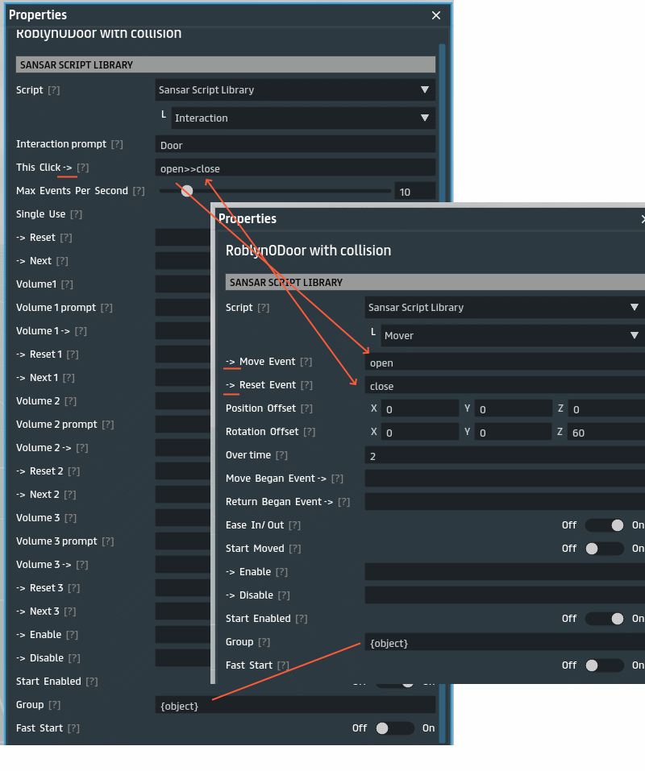
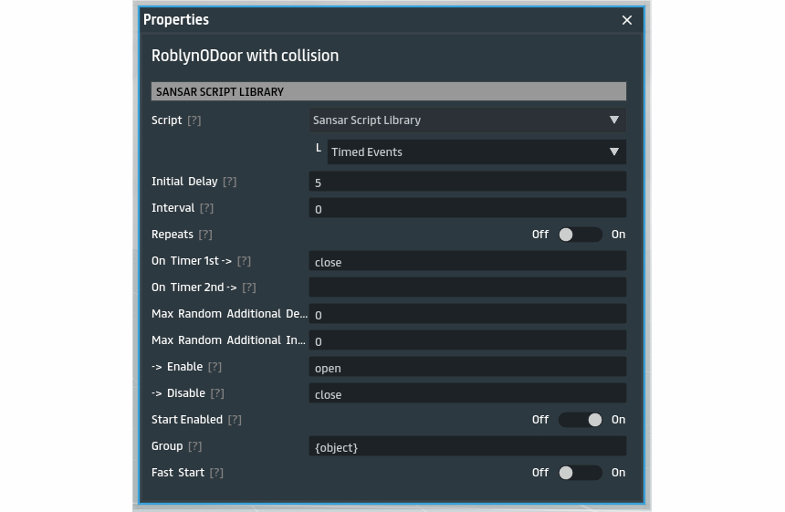
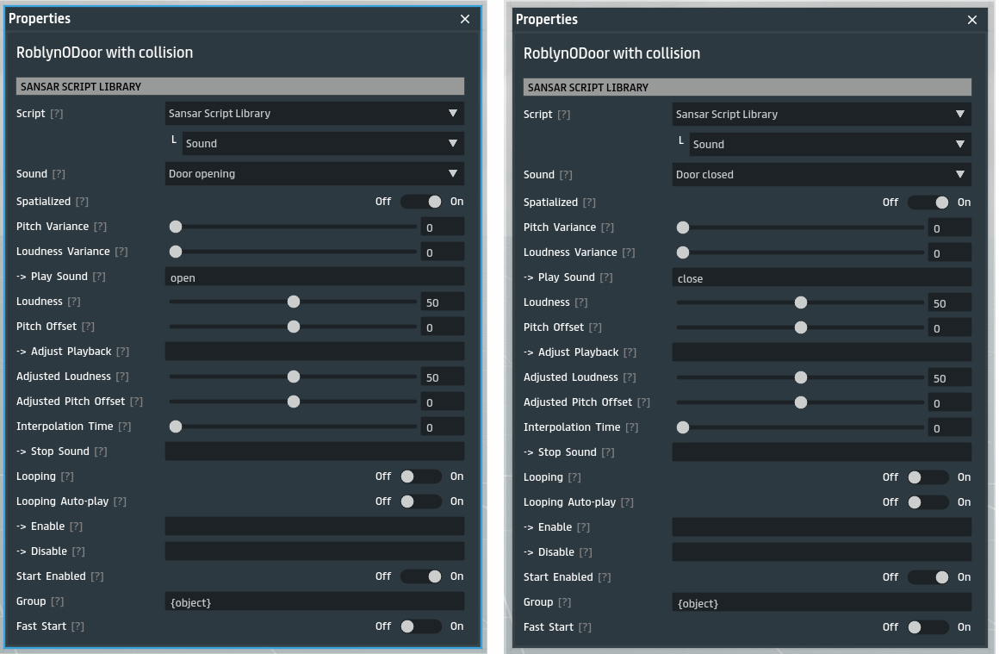

# Door Tutorial

> [Back](../README.md)

This is a simple example to create a click-to-open behaviour, like on a door.

## Setup

To start you need a basic door mesh, which can be any plank really. I used a [free door from the store](https://store.sansar.com/listings/f3f08bdf-b563-4c63-91a0-409e7538eecf/roblynodoor-with-collision). The only thing you will need to do is add a volume to the door, set it to keyframed, and enable `Movable by script`. Movable by script means that scripts can animate smoothly the movement of the object, but only if the object is keyframed, and in order to be keyframed it must have a volume. See the properties below:

A door only rotates at the hinge, meaning the origin should be at the side of the door. The door I bought above has the origin in the center of the object. Thankfully that is fixable by just repositioning the **mesh** and **volume** within the object 1 meter to side. The end result should be that the axis selection widget should appear in the correct position by the side of the door when selecting the **Door** container in object structure. See illustration below:

## Scripts

Now that the door is properly is setup, now we can add our scripts. For a door behavior, we need to be able to click to open the door and rotate it 60 degrees, and when clicked again it should rotate back to closed position. For this we need an `Interaction` sansar script, and a `Mover` sansar script. Thanks to our setup above, rotation will happen around the hinge and therefor rotate like a real door. It is also important to set the **Group** of the scripts to `{object}`, this will make all the events between the scripts keep communication within the object alone and not interfere with other scripts in other objects, this will allow cloning the door many times without having the change the events in the scripts.

Go ahead, build your scene and test.

## Bonus Scripts

Now we can expand the behavior of the door with more scripts. For example, lets add a timer on the door so that it auto-closes after 5 seconds after it was opened with the `Timed Events` sansar script.

In the above script we set timer to 5 seconds, which starts counting seconds when the open event fires, and triggers the close event when its done counting. Also we disable the timer when the close event was fired because we do not need the timer any longer if its already being closed. Don't forget to add `{object}` to keep communication with other scripts in the object.

Next we can add some sounds, I found free [open door sound](https://store.sansar.com/listings/138aadd3-c188-42a0-bd77-c701690daf2a/hinged-door-opening) and [close door sound](https://store.sansar.com/listings/ffcb49c4-6d75-45a2-ab5a-855ebe809886/hinged-door-closed) on the store that we can use. Now we can just need to add two `Sound` sansar scripts:

## Conclusion

We now have a functioning door with 5 sansar scipts in that auto closes after 5 seconds and plays opening/closing sounds.