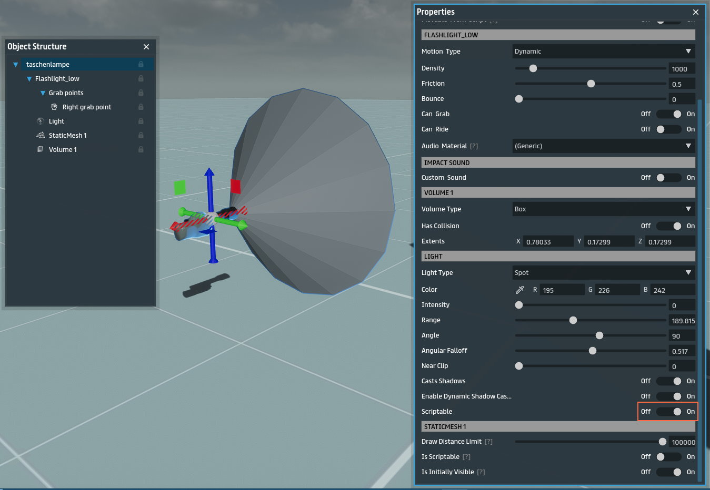
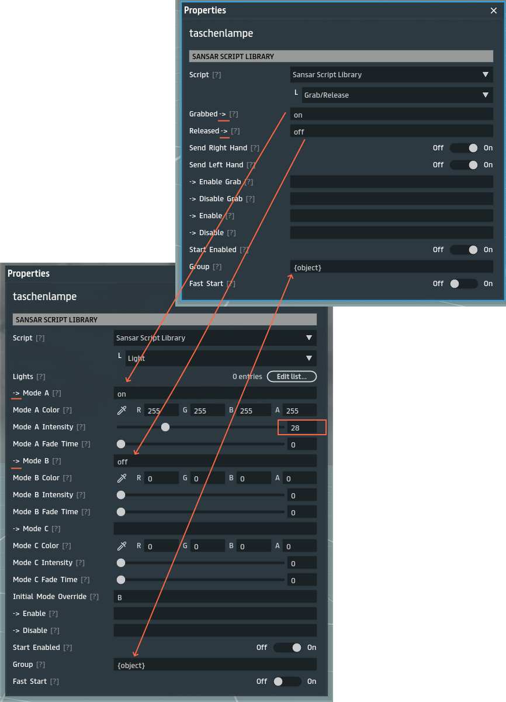
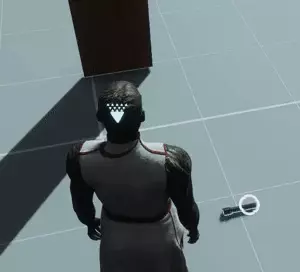

# Flashlight Tutorial

> [Back](../README.md)

In this example, we will create a functioning flashlight that will turn on when picked up, and turn off when dropped. There is a [free flashlight](https://store.sansar.com/listings/06cf6eb5-5e6a-4e0e-9700-b09ff67fc361/taschenlampe) on the store that we can use for this with the mesh and light component defined.

## Setup

First, we must make the light component scriptrable in the flashlight we got above:

We must make sure the object has a grab point which can be added by right clicking the `Lashlight_low` container (this will be named differently based on how you define in the mesh on upload) in object strucure and adding one. The flash light we got above already has a grab point defined. Then we make sure `Can grab` is enabled in the `Flashlight_low` properties.

We also must make sure the flashlight has a light component added to it, which can be done similarly to how we added a grab point. The light should be defined as `Spot` Light Type. The flashlight above already has that defined. Then we make the light scriptable, like shown in the image above.

## Scripts

To make the flashlight functional, we will add the `Grab/Release` sansar script and `Light` scripts to the flashlight, that will make the light turn on or off based on if the object was grabbed or released. To do this you can drag and drop two `Sansar Script Library` from your inventory into the object, or right click the container in `Object Stucture` and add the scripts. We connect the events `on` and `off` to the right light modes in the `Light` script. Thankfully, all of the default values are good to go in both of these scripts except the event names and group name. The **Group** should be defined as `{object}` in both of them, this will make sure multiple objects with these scripts will not have event collisions where a flahslight event triggers another flashlight. Also, you might want to lower the light intensity for the `on` light mode to something like 28, because the default is too bright.

## Conclusion

And voila, now you have a functioning flashlight that turns on or off when grabbed and released.

