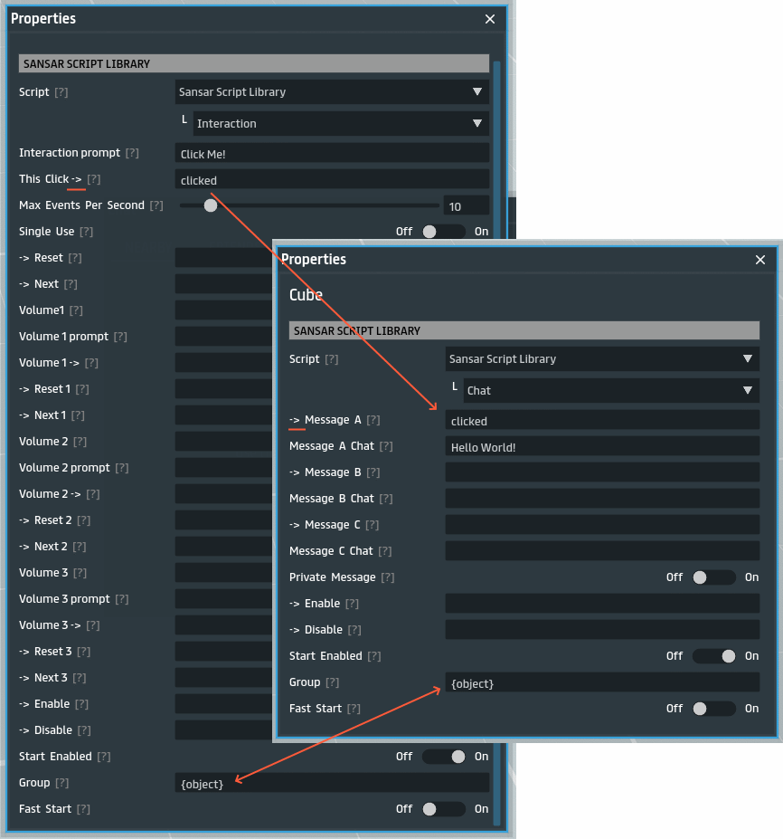
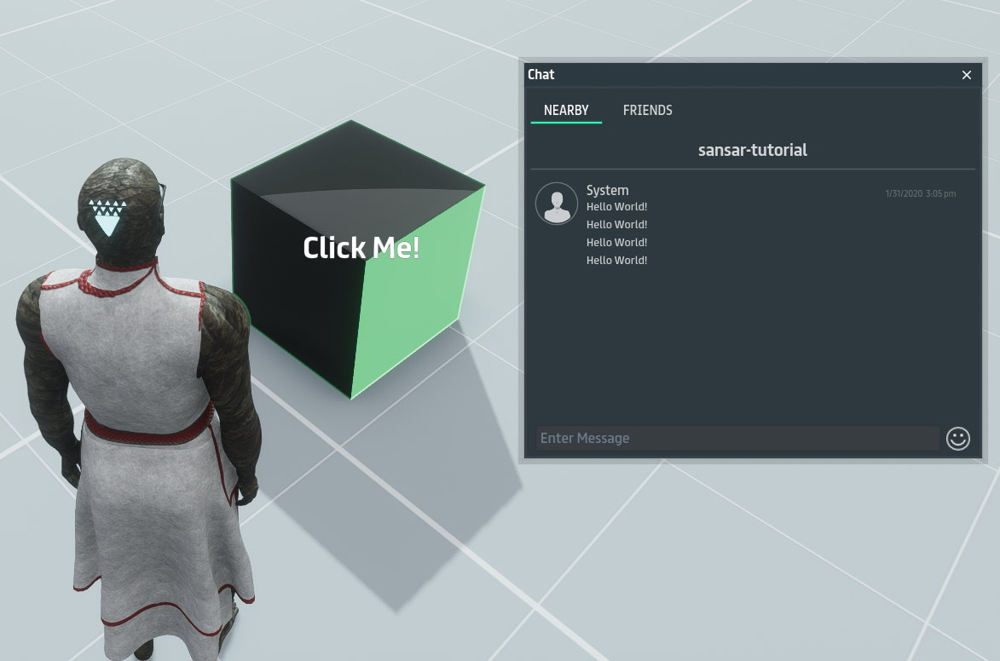

# Hello World Tutorial

> [Back](../README.md)

The most basic example of sansar scripts is the 'Hello World', which means setting up the minimum code to get the object to say 'Hello World!'. This can be done by adding the sansar `Interaction` and `Chat` scripts to a [cube](https://store.sansar.com/listings/7da07036-5c29-46ba-b100-51a496eee289/basic-mesh-cube).

In the above example we have defined the `clicked` event to trigger when the object is clicked in the `Interaction` script, and say in chat 'Hello World!' when the event `clicked` is fired in the `Chat` script. We use `{object}` in **Group** in both scripts so that events in scripts will only trigger other scripts in the same object. This will allow cloning the object without changing the events, otherwise a click from one cube would trigger the chat in another cube, etc.

And the result would look something like this:

