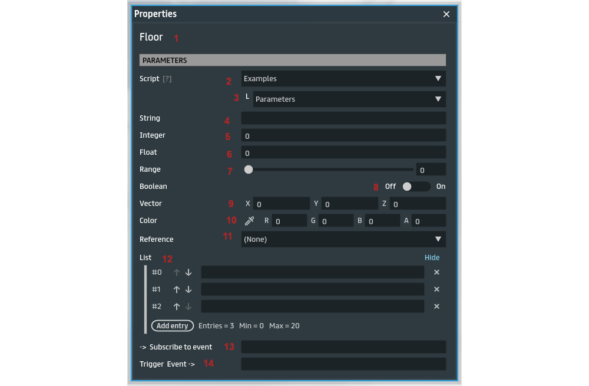
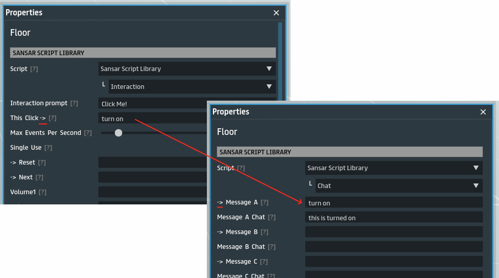
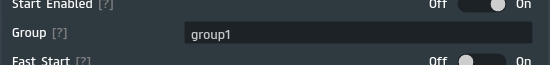
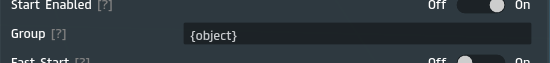

# Intro to Scripts

> [Back](../README.md)

## Script Properties

Almost every script has parameters exposed to the user so they can configure it. The script parameters can be reached by right clicking the script in `Object Structure` and selecting `Properties`.

|#|Description|
|-|-|-|
|1|**Object name** - this is visible in any component properties window|
|2|**Script name** - this is the name as it appears in your inventory, you can select to change script, or update existing one, here|
|3|**Subscript name** - this is the subscript within the selected script. A single script can hold many subscripts. After this point all parameters are different for each script you use, and what you see here are just examples.|
|4|**String parameter** - this accepts any text. This can be multi line text, but currently that is only possible by pasting multi line text from somewhere else|
|5|**Integer parameter** - this accepts only whole numbers|
|6|**Float parameter** - this accepts decimal numbers|
|7|**Range parameter** - tgus is just a number parameter with a slider widget that allows you to pick from a range|
|8|**Boolean parameter** - this is basically a true or false parameter, usually called a switch|
|9|**Vector parameter** - a vector is just a 3 value property, x y and z, which can be used for defineing coordinates or rotations|
|10|**Color parameter** - this accepts RGB values and has a color picker you can use|
|11|**Reference field** - depending on the referece type, this can allow you to refence other items, sounds, and object components (such as light)|
|12|**List parameter** - this allows you to add up to 20 items to a list which can be any of the above types|
|13|**'subscribe to' parameter** - distinguishable from the `->` **at the start** of the param name. This accepts an event name that the script should subscribe to trigger a certain action in the script, read the help text of the parameters to get clues from the script designer|
|14|**'trigger' parameter** - distinguishable from the `->` **at the end** of the name. This accepts an event that the script should trigger when a certain action happens.

## Events

Scripts usually have event parameters which allows scripts to connect (or trigger) other scripts. The conventions in sansar is to name parameters with `->` at the start denote subscribe events (as explained above), or `->` at the end to denote trigger evnets (explained above).

The sansar script library (simple scripts), available to everyone with every install in their inventory, has laid out some conventions and around sending and receiving events by scripts.

In the above example, the interaction script will trigger `turn on` event when the object is clicked, the chat script listens to that event to say in chat `this is turned on`. You can tell which event is subscribing and which event is triggering based on where the `->` is located in the parameter name, as explained above.

### Groups

Simple scripts usually have a group parameter, that will be appended to every event in the script when subscribing or sending events. This allows to maintain a namespace for your events, so you dont accidentally send the same event to unrelated scripts who subscribe to a similar name.

When the defining the event names in parameters, it is possible to override the target group of the event with the `@` symbol, such as `my event@group1`, this will listen for `my event` from the `group1` group when subscribing, or send the event to `group1` when triggering.

Events have a special placeholder that can be use to target events only in the current object, using `{object}`, which simply gets replaced with the object's id dynamically. This is especially useful for rezzed objects, because if more than one are rezzed you have no way to change their group name and would otherwise have event name collisions with the other rezzed objects. This is also perfect for selling scripted objects on the store to guarantee the events will not interfer with other unrelated scripts in whatever scene.

### >>

Events can be defined as a sequence separated by `>>`, which will cause different events to trigger depedning on how many times this event parameter was called. So having an interaction script with the event `on>>off` means that the first time the object is clicked `on` will be sent, and the second click will trigger `off`, and the third click will trigger `on` again. This is a handy trick to define multiple states of an event based on how many times it was triggered.

## General Guidelines

While the event system in Sansar scripts allow for great flexibility and modularity, it is recommended to minimize the use of events, because they quickly pile up and affect the performance of all scripts in the scene. The number of event susbscriptions start to be a bottleneck around 2000 susbscriptions. This may sound like a lot, but if you have hundreds of scripted objects in the scene then that number can easily be reached. In general, if you are not using an event in some script's parameters, remove the value from the param, that means usually deleting default values in parameters. This is why it is recommended to use specialized scripts that combine multiple simple scripts into one as often as possible.

Also you should avoid having a alot of scripts that perform something in the background while idle, such as with repeating timers and scanners. It's best to activate those only when needed.
