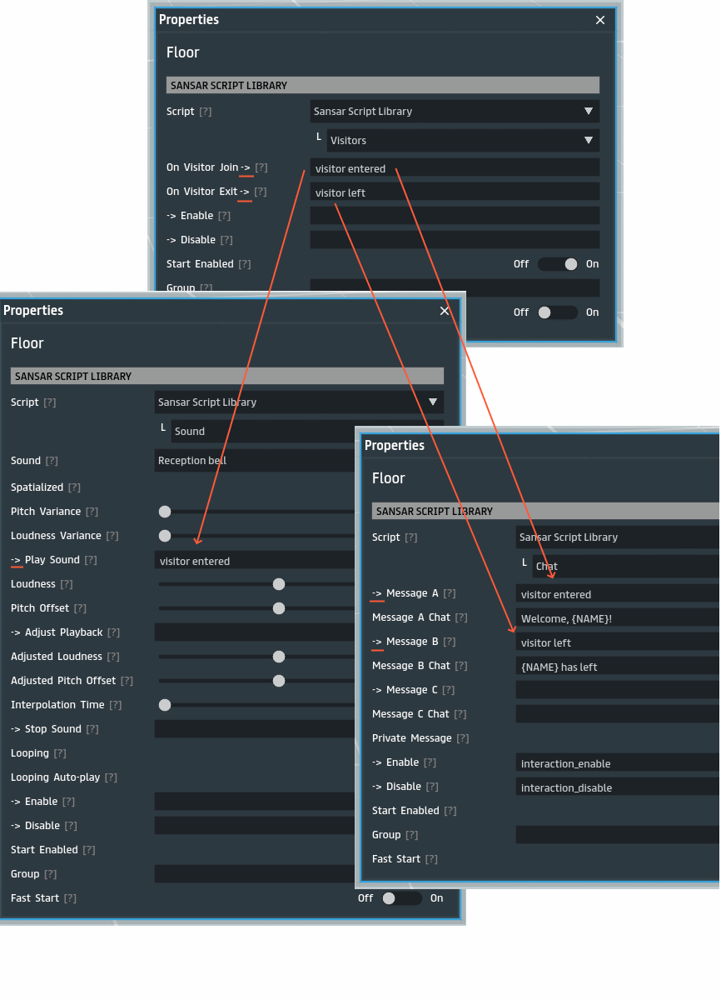

# Visitor Greeter Tutorial

> [Back](../README.md)

The following visitor greeter will prints a message in chat and plays a bell sound when someone enters the experience, and says in chat when they leave.

We will use a reception bell sound, which is available [free on the store](https://store.sansar.com/listings/b6cad1ba-1d8d-48e4-88a5-28654a29769e/reception-bell).

In the above example with use the `Visitors` sansar script to tigger `visitor entered` and `visitor left` events when someonbe joins or leaves the experience. These events then trigger the `Chat` script to say a welcome message, and `Sound` script (with our reception sound) to play a ding when they enter. You can disable **Specialized** parameter to make the sound audiable for everyone in the experience, and not only to those close to the floor origin position.

Because the visitor greeter is needed only once for the entire scene, we do not need to give it a group,and we can just place the 3 scripts in the floor.
